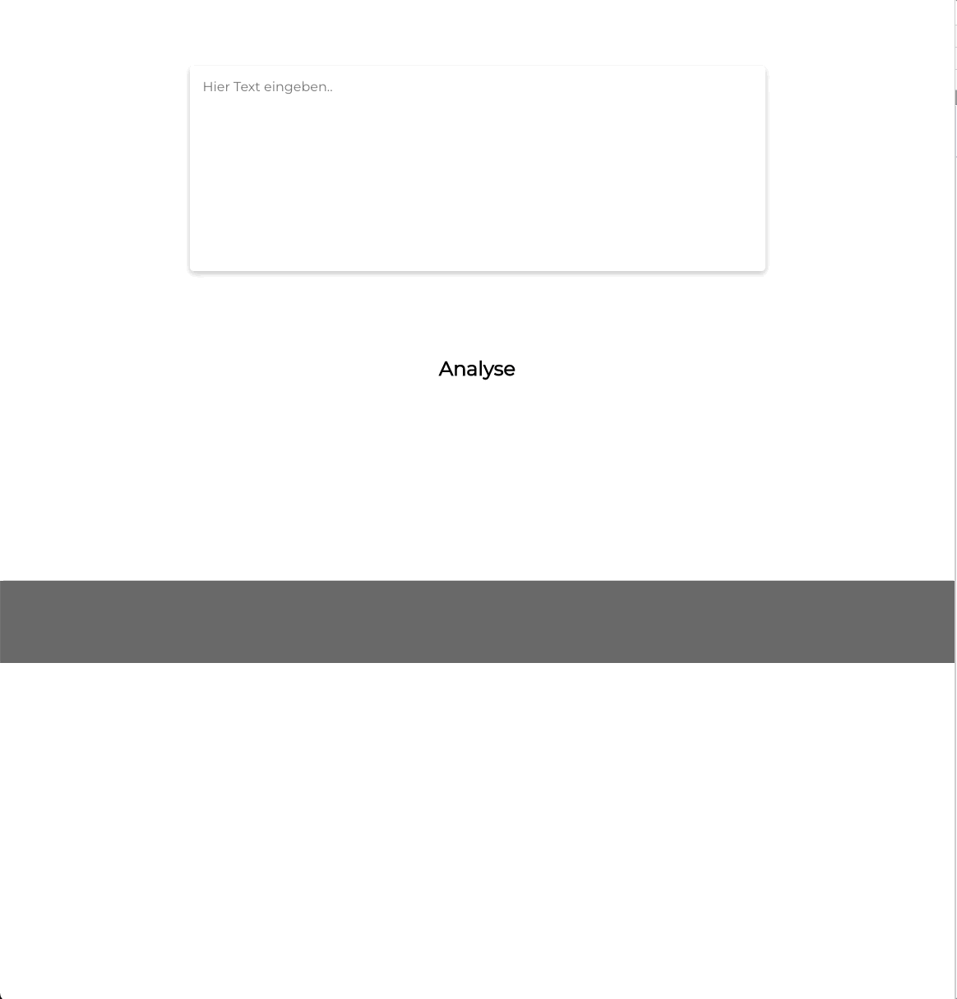

# German spell checker

Input german text and get suggestions for grammar and spelling.

Shows results according to the [Oldenburger Fehleranalyse (OLFA)](https://de.wikipedia.org/wiki/Oldenburger_Fehleranalyse). 

Try it yourself! >>> [LIVE DEMO](https://cosmic-pavlova-82e3af.netlify.app/)

## Development

In the project directory, you can run:

### `npm start`

Runs the app in the development mode.\
Open [http://localhost:3000](http://localhost:3000) to view it in your browser.

The page will reload when you make changes.\
You may also see any lint errors in the console.

### `npm test`

Launches the test runner in the interactive watch mode.\
See the section about [running tests](https://facebook.github.io/create-react-app/docs/running-tests) for more information.
